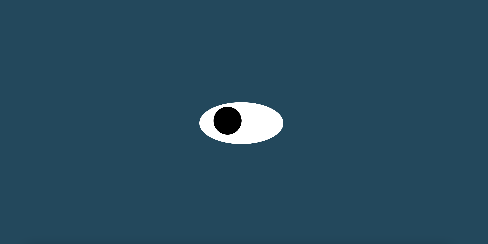

<div align="center" id="top">
     
</div>

# <h1 align="center">Eye-Exercise</h1>

<p align="center">
  <a href="#dart-description">Description</a> &#xa0; | &#xa0; 
  <a href="#dart-demo">Demo</a> &#xa0; | &#xa0;
  <a href="#memo-improvements">Improvements</a> &#xa0; | &#xa0;
  <a href="#art-technologies">Technologies</a> &#xa0; | &#xa0;
  <a href="#white_check_mark-requirements">Requirements</a> &#xa0; | &#xa0;
  <a href="#toolbox-installation">Installation</a> &#xa0; | &#xa0;
  <a href="#joystickhow-to-play">How to Play</a> &#xa0; | &#xa0;
  <a href="#briefcase-license">License</a> &#xa0; | &#xa0;
  <a href="https://github.com/eduardo-ortiz09" target="_blank">Author</a>
</p>

<br>


## :dart: Description ##

This proyect is about an eye that is looking at the cursor of the mouse, any where the cursor goes on the screen the eye will follow it. The proyect is part of the MERN Programming Certificate from the MIT that I am attending. 

## :dart: DEMO ##

If you want to try it just click [here](https://eduardo-ortiz09.github.io/Eye-Exercise)

## :memo: Improvements ##

These are the list of currect improvements:

- :diamonds: Implent some updates that will show more than one eye, maybe a person or a group of people that will all be looking at the same place.	

## :art: Technologies ##

- [HTML](https://www.w3schools.com/html/)
- [CSS](https://www.w3schools.com/css/)
- [JavaScript](https://www.w3schools.com/js/)

## :white_check_mark: Requirements ##

Before starting :checkered_flag:, you need to have [Git](https://git-scm.com) installed.

## :toolbox: Installation ##

```bash
# Clone this project
$ git clone https://github.com/eduardo-ortiz09/Eye-Exercise.git
# Access to directory
$ cd Eye-Exercise
# Run index.html in a browser
```


## :briefcase:	 License ##

This project is under license from MIT. For more details, see the [LICENSE](LICENSE) file.


Made with :heart: by <a href="https://github.com/eduardo-ortiz09" target="_blank">Eduardo Ortiz</a>

&#xa0;

<a href="#top">Back to top</a>
